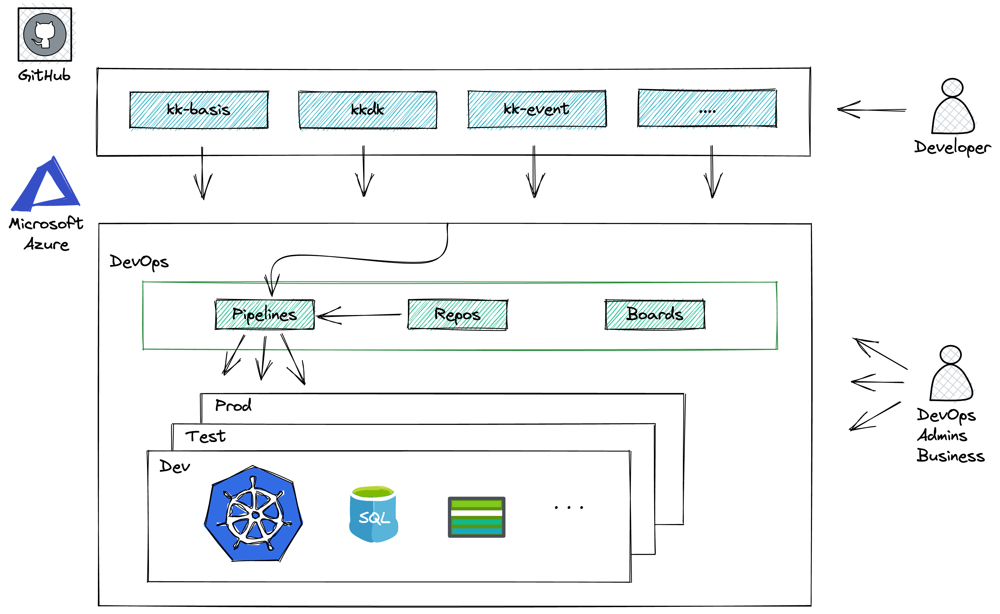
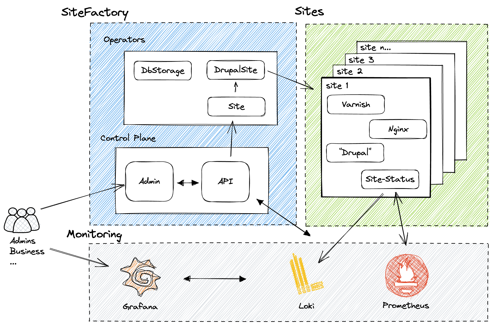
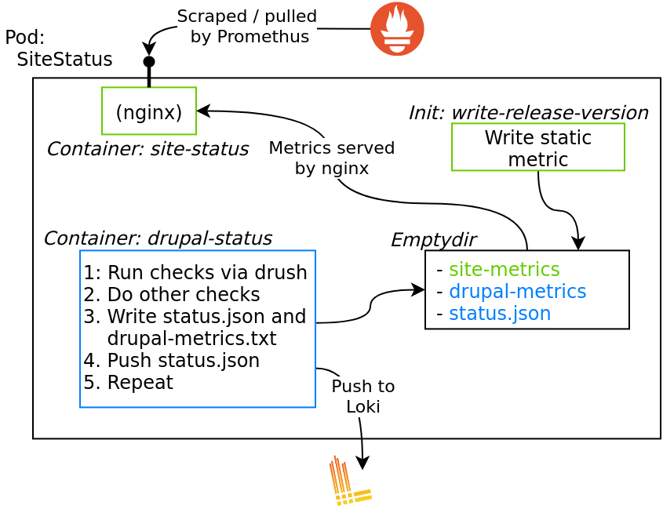
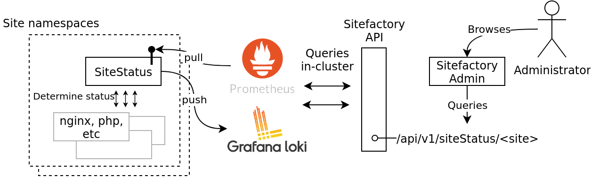

# Monitorering af Site Status

## Webplatformen

* Lader kommunen udvikle på en række Drupal profiler og drive dem på en cloud platform
* Dækker den fulde lifecycle fra udvikling og push til sitet er live og bliver opdateret



* Infrastrukturmæssigt:
  * En række repositories og workflows på Github
  * Et par repositories og pipelines i Azure DevOps
  * 3 produktions miljøer (dev, test, prod) med Kubernetes og managed services

### Tal

* Dev + test: Ca 120 sites og 20 servere
* Prod: ca 200 sites og 22
* Lige under 1300 containere i prod
* 10 forskellige Drupal profiler


## Sitefactory

Automatiseringen der kører i et miljø der lader mennesker og automatik opretter, opgradere og nedlægge sites



* Sitefactory
  * Admin (NestJS)
  * API (React Admin)
  * Operators (Go, Ansible, Helm)

* Monitorering
  * Prometheus
  * Loki
  * Grafana
  
## Statuscheck v1

Vi leverede SiteFactory med et statuscheck

* Baseret på CronJob
* Skrev output til stdout som man så med lidt god vilje kunne samle op med Loki

```yaml
command: ["/bin/sh", "-c"]
# Run core-requirements twice. First to get a full status and then
# to detect errors. We wrap the entire output in an json object
# for easier parsing downstream.
# Upon error, exit 1 to fail the job/pod.
args:
  - |
    set -e
    full=$(drush core-requirements --format=json 2> /dev/null)
    errors=$(drush core-requirements --severity=2 --format=json 2> /dev/null)
    echo "{"
    echo "\"full\":${full},"
    echo "\"errors\":${errors}"
    echo "}"
    # Fail if we did not get an empty list of errors.
    if [ ! "${errors}" = "[]" ]; then
      exit 1;
    fi
```

Ikke optimalt
* Performede ekstremt dårligt
* Status var i praksis binær (exitcode)

## Statuscheck v2

Mål

* Gør det muligt for en enkelt person at få overblik over alle sites status, **hurtigt**.

* Støt den daglige fejlsøgning ved at kunne give indbilk i **hvorfor** ting fejler.
* Byg det på en måde der understøtter at vi gøre mere af det her og kan **automatisere** og **alarmere** mere og mere.

### Design

Vi valgte at basere status-checkket på Prometheus **metrics** og **events** sendt til Loki.

I hvert site namespace kører vi en site-status container der integrerer med Loki og Prometheus




### Metrics til prometheus

**Metric** (simplificeret)

```bash
# HELP drupal_updatedb_pending_count number of pending database updates.
# TYPE drupal_updatedb_pending_count gauge
drupal_updatedb_pending_count{site="site1"} 0
# HELP drupal_requirements_count drupal requirements with the given status
# TYPE drupal_status gauge
drupal_requirements_count{site="site1", severity="error"} 0
drupal_requirements_count{site="site1", severity="warning"} 2
```

Prometheus **scraper** metrics vi eksponerer via Nginx - vi konfigurerer Prometheus via en Service Monitor

```yaml
apiVersion: monitoring.coreos.com/v1
kind: ServiceMonitor
metadata:
  name: site-status-metrics
spec:
  namespaceSelector:
    any: true
  selector:
    matchLabels:
      prom-target: site-status
  endpoints:
  - port: metrics
    path: /drupal-metrics
  - port: metrics
    path: /site-metrics
```

### Loki

**Event (rapport)** (simplificeret)

```json
{
  core-requirement-warning: [
    {
      title: "Experimental themes enabled",
      severity: "Warning",
      value: "Experimental themes found, Use at your own risk."
    },
    {
      title: "KK Login",
      severity: "Warning",
      value: "User with id 1 is not blocked"
    }
  ]
}
```


Vi **pusher** til Loki der har [et simpelt endpoint](https://grafana.com/docs/loki/latest/api/#push-log-entries-to-loki) til at modtage logs

```php
// site-status.php

// ...
// Setup curl.
$url = $settings['lokiEndpoint'];
$ch = curl_init($url);

$statusObjectEncoded = json_encode($statusObject);

// Prepare a Loki post payload.
// See https://grafana.com/docs/loki/latest/api/#push-log-entries-to-loki
$payload = [
  'streams' => [
    [
      'stream' => [
        // We have to add this ourselves now that we're not going
        // via promtail.
        'namespace' => $settings['namespace'],
        'has_errors' => count($errors) > 0,
      ],
      'values' => [
        // format:
        //   [ "<unix epoch in nanoseconds>", "<log line>" ]
        [(string) $statusObject['meta']['time']['timeNs'], $statusObjectEncoded],
      ],
    ],
  ],
];
// ...


```


### Statusflow 




## Status

* Er i dev og test
* Performer langt langt bedre
* Har meget mere potentiale
  * Alarmering
  * Automatisering
  * Andre klienter


## Udfordringer

### Hvornår i piplinen tolker man på data?

Hvor besluttes at et site er i "Error" eller "Warn"

```bash
# HELP drupal_requirements_count drupal requirements with the given status
# TYPE drupal_status gauge
drupal_requirements_count{site="site1", severity="ok"} 3
drupal_requirements_count{site="site1", severity="info"} 24
drupal_requirements_count{site="site1", severity="warning"} 6
drupal_requirements_count{site="site1", severity="error"} 0
# HELP drupal_bootstrap_status Whether the drupal is able to bootstrap
# TYPE drupal_bootstrap_status gauge
drupal_bootstrap_status{site="site1", application="sitefactory", metric_category="status", component_status="drupal"} 1
# HELP drupal_info Information about the versions and environment
# TYPE drupal_info gauge
drupal_info{site="site1", application="sitefactory", metric_category="status", component_status="drupal", drupal_version="9.3.19", php_version="7.4.27"} 1
# HELP drupal_updatedb_pending_count number of pending database updates.
# TYPE drupal_updatedb_pending_count gauge
drupal_updatedb_pending_count{site="site1", application="sitefactory", metric_category="status", component_status="drupal"} 0
# HELP drupal_has_errors whether any errors where detected during the status-check. Depending on the detected error the site may still be working normally. Inspect the status report pushed by the status-check for further details.
# TYPE drupal_has_errors gauge
```


Kode bag `/api/v1/siteStatus`

```typescript
      // documentation/observability.md for a list of metrics.
      switch (series.metric.name) {
        // drupal_error_detected tracks whether any errors where detected, we rely
        // on this metric for determining whether we're in an error-state and use
        // the logic below mostly to spot warnings.
        // ...
        // The metric above should have us covered, so we only check for warnings.
        case "drupal_requirements_count": {
          const sev: RequirementSeverity = series.metric.labels
            .severity as RequirementSeverity;

          // We append the severity to the metric to avoid having to tag on
          // all the labels in order for downstream to determine which requirement
          // we're looking at.
          name += "_" + sev;
          if (sev === "warning" && series.value.value > 0) {
            bumpStatus(siteStatus, "WARN");
          }

          if (sev === "error" && series.value.value > 0) {
            siteStatus.drupalStatus.requirementsOk = false;
          }

          break;
        }
      }
```


