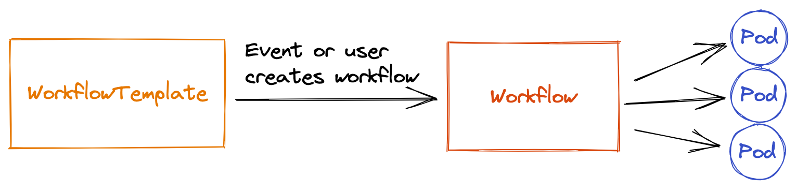
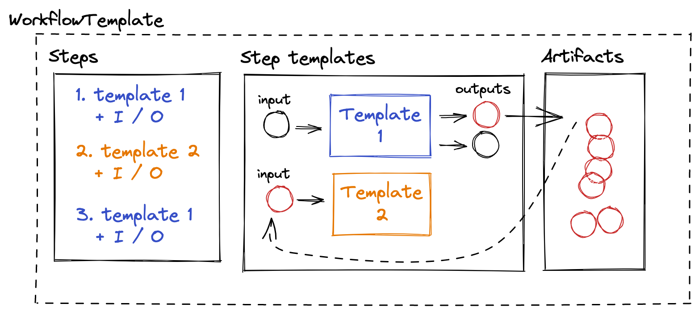

# Argo workflows

## Hvorfor?

* På "Webplatformen på Scaleway" havde vi brug for en pipline runner til at
  automatisere processer så som
  * Promovering af releases imellem miljøer
  * Provisionering / Konfiguration af infrastruktur
  * ...
* "Automatisering" betyder her "undgå at køre kommandoer fra en laptop"
* Argo projektet er mest kendt for [Argo CD](https://argo-cd.readthedocs.io/en/stable/)
  som vi også bruger og derfor var Argo Workflows et godt bud på
  noget der kunne løfte vores behov.

## Hvad er det?

* <https://argoproj.github.io/argo-workflows/>

> Argo Workflows is an open source container-native workflow engine for orchestrating parallel jobs on Kubernetes. Argo Workflows is implemented as a Kubernetes CRD (Custom Resource Definition).




* *advarsel* - De har en lidt for løs brug af ordet "template"

* En workflow template består af en række trin der kører "step" templates
* Steps kan have input (parametre der kan komme fra brugere eller andre step.
* Outputs kan både være simple tekst-strenge, og "artifacts" der persisteres.




Simplificeret workflow (har fjernet en bunke auth og kube detaljer)

```yaml
apiVersion: argoproj.io/v1alpha1
kind: WorkflowTemplate
metadata:
  name: pulumi-preview-update
spec:
  entrypoint: steps

  templates:
  - name: steps
    steps:

    - - name: github-authorize
        template: github-authorize

    - - name: pulumi-preview
    template: pulumi-preview
    arguments:
      parameters:
      - name: github-token
        value: "{{`{{steps.github-authorize.outputs.parameters.github-token}}`}}"

    # Ask for approval.
    - - name: approval
        template: approval

    # Perform the update.
    - - name: pulumi-up
        when: {{`'{{steps.approval.outputs.parameters.approval}} == YES'`}}
        template: pulumi-up
        arguments:
          artifacts:
          - name: pulumi-plan
            from: "{{`{{steps.pulumi-preview.outputs.artifacts.pulumi-plan}}`}}"
          parameters:
          - name: github-token
            value: "{{`{{steps.github-authorize.outputs.parameters.github-token}}`}}"

  # Task: github-authorize
  - name: github-authorize
    outputs:
      parameters:
      - name: github-token
        valueFrom:
          path: /tmp/github-token
    container:
      image: my-registry:/gh-fetch-app-access-token:1.0.0

  # Task: pulumi-preview
  - name: pulumi-preview
    inputs:
      parameters:
      - name: github-token
    outputs:
      artifacts:
      - name: pulumi-plan
        path: /tmp/pulumi-plan.json
    container:
      name: pulumi-preview
      image: ghcr.io/pulumi/pulumi-nodejs:latest
      args: ['pulumi', 'preview']
        - name: GITHUB_TOKEN
          value: "{{`{{inputs.parameters.github-token}}`}}"

  # Task: approval
  - name: approval
    suspend: {}
    inputs:
      parameters:
      - name: approval
        default: 'NO'
        enum:
        - 'YES'
        - 'NO'
    outputs:
      parameters:
      - name: approval
        valueFrom:
          supplied: {}

  # Task: pulumi-up
  - name: pulumi-up
    inputs:
      parameters:
      - name: github-token
      artifacts:
      - name: pulumi-plan
        path: /tmp/pulumi-plan.json

container:
      name: pulumi-up
      image: ghcr.io/pulumi/pulumi-nodejs:latest
      args: ['pulumi', 'up']
      env:
        - name: PULUMI_PLAN_FILE
          value: "/tmp/pulumi-plan.json"
        - name: GITHUB_TOKEN
          value: "{{`{{inputs.parameters.github-token}}`}}"
````

## Skal / skal ikke

Skal

* Pga sikkerheds-krav (on prem / GDPR / etc) - kræver du har nogen der kan
  køre dit cluster
* Giver mulighed for ekstrem stor kontrol af hvordan, hvor og hvorfor workflows
  kører.
* Hvis man alligevel er i gang i med Argo - der er store synergi muligheder.

Skal ikke

* Hvis man ikke rigtig gode grunde.
* Arbejdet med opsætningen, vedligehold og sikring af Argo Workflows er *ekstremt*
  meget større end med en managed løsning. Jeg har brugt en måned på at kunne køre
  `pulumi up`.

## Alternativer

* Hvis GDPR ikke er et problem: Github actions
  * Evt med [Actions Runner Controller](https://github.com/actions/actions-runner-controller)
* Ellers
  * [Tekton](https://tekton.dev/)
